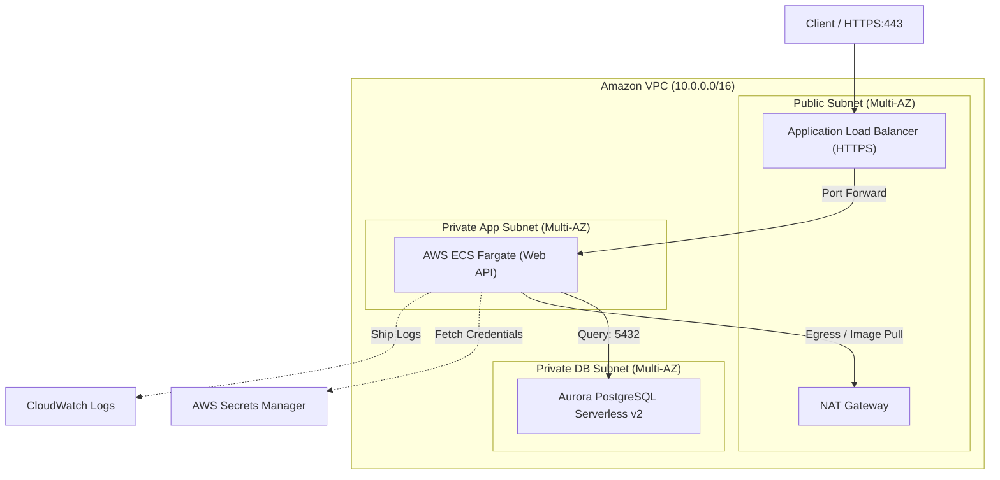

# CloudForge ECS Aurora IaC

> **堅牢性と俊敏性を極めた、商用グレードのコンテナ型Web API基盤インフラ**

スタートアップから中規模エンタープライズの商用運用に耐えうる「堅牢性」と、属人化を排除し運用負荷を最小化する「シンプルさ」を兼ね備えた、AWS ECS Fargate + Amazon Aurora PostgreSQL Serverless v2 の3層アーキテクチャIaCリポジトリです。

---

## 🌟 インフラの特長

- **完全サーバーレス指向**: OS管理・EC2インスタンス管理を完全排除。Fargate (Graviton) と Aurora Serverless v2 により、パッチ適用やキャパシティ管理を自動化。
- **堅牢なゼロトラスト型ネットワーク**: 外部トラフィックはALB (HTTPS/ACM) 経由のみ。App層、DB層は完全閉域サブネットに配置し、セキュリティグループ参照で段階的に通信を制御。
- **セキュアなクレデンシャル連携**: DBマスターパスワード等は AWS Secrets Manager で動的生成し、ECSタスク起動時に環境変数として安全に注入。
- **環境分離 (dev / prod)**: 単一コードベースから再利用可能なモジュール（Network / Database / ECS Service）を用いて、環境ごとの冗長性やコスト最適化（Fargate Spot / NAT冗長度 / ACUスケーリング範囲）を制御。

---

## 🏛️ システム構成図 (Mermaid)



---

## 📁 ディレクトリ構造

```text
.
├── modules/
│   ├── networking/     # VPC, Subnet, Route Table, NAT GW, IGW
│   ├── database/       # Aurora Serverless v2, Secrets Manager, DB Subnet Group
│   └── ecs_service/    # ALB, ECS Cluster/Service/Task, IAM Role, Security Groups
└── environments/
    ├── dev/            # 開発環境（コスト最適化: NAT 1台, Fargate Spot, 最小ACU）
    │   ├── main.tf
    │   ├── variables.tf
    │   └── terraform.tfvars
    └── prod/           # 本番環境（高可用性: Multi-AZ NAT, Multi-AZ Aurora, 削除保護）
        ├── main.tf
        ├── variables.tf
        └── terraform.tfvars
```

---

## 🚀 展開手順

### 1. 前提条件
- Terraform 1.6+
- AWS CLI (適切なデプロイ権限を持つプロファイルの設定)
- AWS Provider 5.x

### 2. 環境の初期化と適用

```bash
# 対象環境のディレクトリへ移動
cd environments/dev

# バックエンドとプロバイダーの初期化
terraform init

# 実行計画の確認
terraform plan

# インフラリソースの適用
terraform apply
```

---

## 🎭 キャスト（制作クレジット）

このインフラストラクチャは、『AIアプリ工場劇場』のエージェント達の共創によって設計・構築・検証されました。

- **要件定義・アーキテクチャ設計**: agent🔵
- **インフラ構想・リサーチ**: agent🍇
- **Terraform コード実装**: agent🍊
- **静的解析・品質検証・セキュリティ監査**: agent🟢
- **プロデュース & プロジェクト統括**: agent🟡
